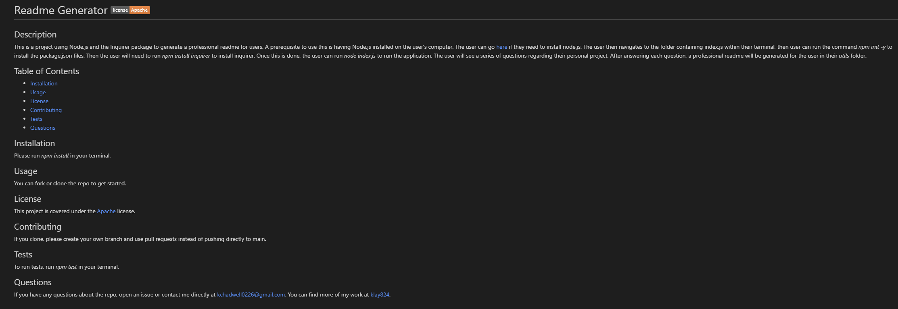
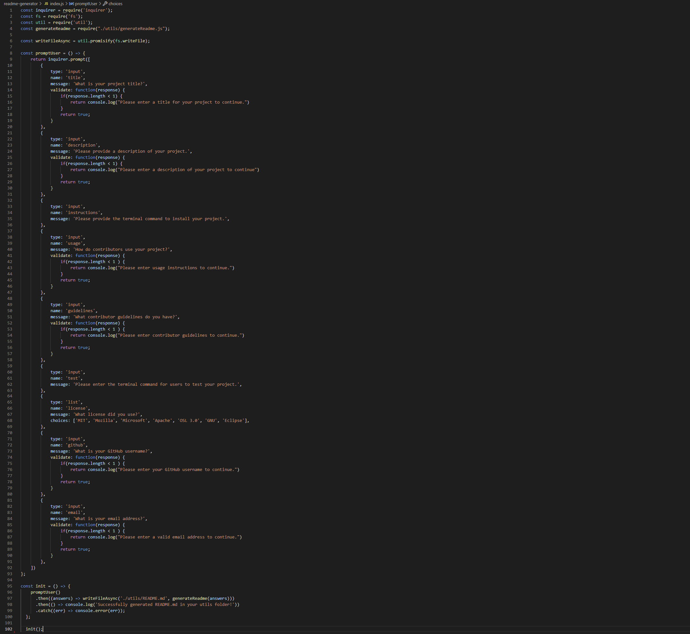
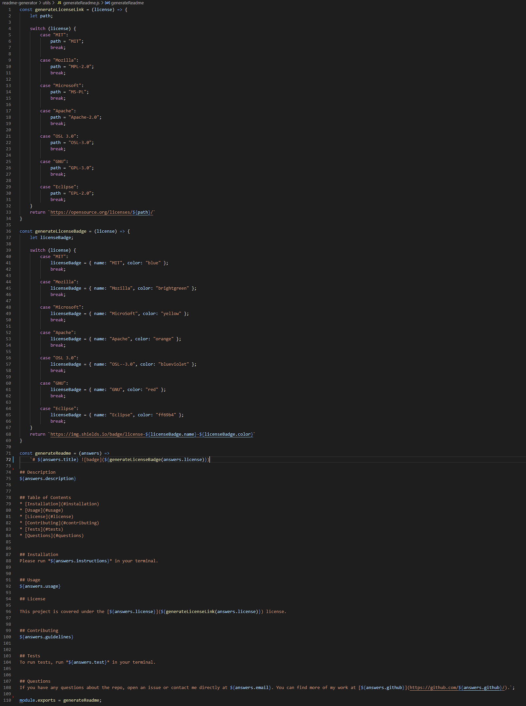
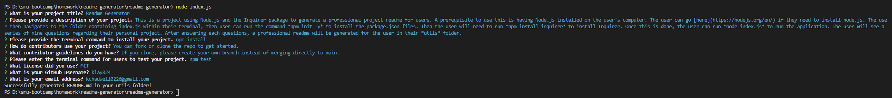

# Readme Generator 

## Table of Contents
* [Description](#description)
* [Technology Used](#technology)
* [Resources](#resources)
* [Licensing Information](#licensing)
* [GIF Demonstration](#gif)
* [Screenshots](#screenshots)
 
 

## Description

This is a project using Node.js and the Inquirer package to generate a professional project readme for users. A prerequisite to use this is having Node.js installed on the user's computer. The user can go [here](https://nodejs.org/en/) if they need to install node.js.  The user then navigates to the folder containing index.js within their terminal, then user can run the command *npm init -y* to install the package.json files. Then the user will need to run *npm install inquirer* to install inquirer.  Once this is done, the user can run *node index.js* to run the application. The user will see a series of nine questions regarding their personal project. After answering each question, a professional readme will be generated for the user in their *utils* folder.

### Please follow [this link](https://youtu.be/H4PUU-bx0Qs) to watch a video demonstration of the application running.
 

## Technology Used
* JavaScript
* Node.js
* Inquierer Package
 
 

## Resources
* [NPM Inquirer](https://www.npmjs.com/package/inquirer)
* [Shields.io](https://shields.io/)
 
 

## Licensing Information
This project is covered under the MIT license.
 
 

## GIF Demonstration of Application

 
 

## Screenshots
#### Generated Readme Screenshot

 
 

#### index.js Screenshot

 
 

#### generateReadme.js Screenshot

 
 

#### Terminal Screenshot
